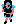

+++
title = "エウロン西地方"
+++

* 北西の島: グリーン島
* 北東の島: スカン島

他地域へのアクセス:

* (247, 153) の関所から[エウロン東地方](@/map/map-02/_index.md) (20, 153) へ。
* (139, 222) の骨ワープから[リカントス地方](@/map/map-05/_index.md) (72, 14) へ。

他地域からのアクセス:

* [エウロン東地方](@/map/map-02/_index.md) (16, 153) の関所から (243, 153) へ。
* [エウロン東地方](@/map/map-02/_index.md) (34, 23) の石ワープから (230, 140) へ。
* [エウロン東地方](@/map/map-02/_index.md) (78, 8) の石ワープから (230, 140) へ (通常プレイでは到達不能と思われる)。
* [ラタニア北地方](@/map/map-04/_index.md) (161, 74) の石ワープから (109, 119) へ (通常プレイでは到達不能と思われる)。

出現NPC:

*  アマゾネス

<!-- SVG {{{ -->
<svg width="1536" height="1536" viewbox="0 0 2048 2048">
<defs>
<image id="svg-asset-bg" width="2048" height="2048" href="map-01.webp" />
<image id="svg-asset-event" width="16" height="16" href="icon-event.png" />
<image id="svg-asset-destination" width="16" height="16" href="icon-destination.png" />
<image id="svg-asset-actor-0x0D" width="16" height="24" href="actor-0x0D.png" />
</defs>
<use href="#svg-asset-bg" x="0" y="0"></use>
<text class="caption-48" x="256" y="64" fill="pink">グリーン島</text>
<text class="caption-48" x="1760" y="96" fill="pink">スカン島</text>
<text class="caption-32" x="720" y="160" fill="yellow">船</text>
<text class="caption-24" x="840" y="288" fill="yellow">骨</text>
<text class="caption-24" x="600" y="440" fill="yellow">船</text>
<text class="caption-24" x="328" y="760" fill="yellow">風の粉</text>
<text class="caption-32" x="1872" y="416" fill="yellow">船</text>
<text class="caption-24" x="1708" y="524" fill="yellow">？</text>
<text class="caption-24" x="1828" y="792" fill="yellow">船</text>
<text class="caption-24" x="660" y="772" fill="yellow">石</text>
<text class="caption-24" x="740" y="768" fill="yellow">骨</text>
<text class="caption-24" x="892" y="968" fill="yellow">石</text>
<text class="caption-24" x="1144" y="760" fill="yellow">切株</text>
<text class="caption-24" x="672" y="1300" fill="yellow">船</text>
<text class="caption-24" x="1168" y="1308" fill="yellow">切株</text>
<text class="caption-24" x="440" y="2004" fill="yellow">手形</text>
<text class="caption-24" x="1076" y="1524" fill="yellow">浮遊石</text>
<text class="caption-24" x="1204" y="1604" fill="yellow">木</text>
<text class="caption-24" x="1228" y="1836" fill="yellow">木</text>
<text class="caption-24" x="1108" y="1816" fill="yellow">骨</text>
<text class="caption-32" x="1408" y="1216" fill="yellow">アドニス</text>
<text class="caption-24" x="1836" y="1160" fill="yellow">石</text>
<text class="caption-32" x="2004" y="1240" fill="yellow">関</text>
<rect x="1152" y="256" width="128" height="128" stroke="red" fill="none" />
<use href="#svg-asset-actor-0x0D" x="1208" y="308"><title>アマゾネス「いい天気ですね」(到達不能)</title></use>
<rect x="384" y="512" width="128" height="128" stroke="red" fill="none" />
<use href="#svg-asset-actor-0x0D" x="440" y="564"><title>アマゾネス「いい天気ですね」</title></use>
<rect x="640" y="640" width="128" height="128" stroke="red" fill="none" />
<use href="#svg-asset-actor-0x0D" x="696" y="692"><title>アマゾネス「気をつけて行きな」</title></use>
<rect x="1664" y="640" width="128" height="128" stroke="red" fill="none" />
<use href="#svg-asset-actor-0x0D" x="1720" y="692"><title>アマゾネス「いい天気ですね」</title></use>
<rect x="1152" y="768" width="128" height="128" stroke="red" fill="none" />
<use href="#svg-asset-actor-0x0D" x="1208" y="820"><title>アマゾネス「悪い王をやっつけてよ」</title></use>
<rect x="1536" y="896" width="128" height="128" stroke="red" fill="none" />
<use href="#svg-asset-actor-0x0D" x="1592" y="948"><title>アマゾネス「気をつけて行きな」</title></use>
<rect x="1024" y="1152" width="128" height="128" stroke="red" fill="none" />
<use href="#svg-asset-actor-0x0D" x="1080" y="1204"><title>アマゾネス「湖のほとりには不思議がある」</title></use>
<rect x="768" y="1280" width="128" height="128" stroke="red" fill="none" />
<use href="#svg-asset-actor-0x0D" x="824" y="1332"><title>アマゾネス「7番目はキネラシア」</title></use>
<rect x="1536" y="1408" width="128" height="128" stroke="red" fill="none" />
<use href="#svg-asset-actor-0x0D" x="1592" y="1460"><title>アマゾネス「グリーン島の湖で吹き鳴らせ」</title></use>
<rect x="384" y="1792" width="128" height="128" stroke="red" fill="none" />
<use href="#svg-asset-actor-0x0D" x="440" y="1844"><title>アマゾネス「試合に勝って名声を上げなさい」</title></use>
<rect x="1024" y="1792" width="128" height="128" stroke="red" fill="none" />
<use href="#svg-asset-actor-0x0D" x="1080" y="1844"><title>アマゾネス「南西の端から3本目」</title></use>
<rect x="1536" y="1792" width="128" height="128" stroke="red" fill="none" />
<use href="#svg-asset-actor-0x0D" x="1592" y="1844"><title>アマゾネス「悪い王をやっつけてよ」</title></use>
<a href="#event-41-89">
<use href="#svg-asset-event" x="328" y="712"><title>(41, 89): イベント 0xFD: ハーモニカを使うと風の粉を入手</title></use>
</a>
<a href="#event-57-245">
<use href="#svg-asset-event" x="456" y="1960"><title>(57, 245): イベント 0xEB: 手形の落とし物</title></use>
</a>
<a href="#event-85-91">
<use href="#svg-asset-event" x="680" y="728"><title>(85, 91): イベント 0x7C: 石ワープ ((109, 119) へ)</title></use>
</a>
<a href="#event-90-23">
<use href="#svg-asset-event" x="720" y="184"><title>(90, 23): イベント 0x56: グリーン島の船小屋 (エウロンの海岸 (88, 161) へ)</title></use>
</a>
<a href="#event-104-31">
<use href="#svg-asset-event" x="832" y="248"><title>(104, 31): イベント 0x87: 骨ワープ ((90, 94) へ)</title></use>
</a>
<a href="#event-138-185">
<use href="#svg-asset-event" x="1104" y="1480"><title>(138, 185): イベント 0xF1: 浮遊石を入手</title></use>
</a>
<a href="#event-139-222">
<use href="#svg-asset-event" x="1112" y="1776"><title>(139, 222): イベント 0x88: 骨ワープ (リカントス地方 (72, 14) へ)</title></use>
</a>
<a href="#event-145-90">
<use href="#svg-asset-event" x="1160" y="720"><title>(145, 90): イベント 0x99: 切り株ワープ ((148, 158) へ)</title></use>
</a>
<a href="#event-151-195">
<use href="#svg-asset-event" x="1208" y="1560"><title>(151, 195): イベント 0x93: 木ワープ ((154, 224) へ)</title></use>
</a>
<a href="#event-182-159">
<use href="#svg-asset-event" x="1456" y="1272"><title>(182, 159): イベント 0x03: アドニスの町の入口へ</title></use>
</a>
<a href="#event-234-55">
<use href="#svg-asset-event" x="1872" y="440"><title>(234, 55): イベント 0x56: スカン島の船小屋 (グリーン島 (73, 50) へ)</title></use>
</a>
<a href="#event-247-153">
<use href="#svg-asset-event" x="1976" y="1224"><title>(247, 153): イベント 0xA2: 関所 (エウロン東地方 (20, 153) へ)</title></use>
</a>
<a href="#dst-181-162">
<use href="#svg-asset-destination" x="1448" y="1296"><title>(181, 162): ワープ先 0x04: アドニスの町手前</title></use>
</a>
<a href="#dst-214-60">
<use href="#svg-asset-destination" x="1712" y="480"><title>(214, 60): ワープ先 0x7A: (ワープ元が存在しない?)</title></use>
</a>
<a href="#dst-230-140">
<use href="#svg-asset-destination" x="1840" y="1120"><title>(230, 140): ワープ先 0x7B: エウロン東地方 (34, 23) の石ワープ先</title></use>
</a>
<a href="#dst-109-119">
<use href="#svg-asset-destination" x="872" y="952"><title>(109, 119): ワープ先 0x7C: (85, 91) の石ワープ先</title></use>
</a>
<a href="#dst-90-94">
<use href="#svg-asset-destination" x="720" y="752"><title>(90, 94): ワープ先 0x87: (104, 31) の骨ワープ先</title></use>
</a>
<a href="#dst-154-224">
<use href="#svg-asset-destination" x="1232" y="1792"><title>(154, 224): ワープ先 0x93: (151, 195) の木ワープ先</title></use>
</a>
<a href="#dst-148-158">
<use href="#svg-asset-destination" x="1184" y="1264"><title>(148, 158): ワープ先 0x99: (145, 90) の切り株ワープ先</title></use>
</a>
<a href="#dst-243-153">
<use href="#svg-asset-destination" x="1944" y="1224"><title>(243, 153): ワープ先 0xA3: エウロン東地方への関所手前</title></use>
</a>
<a href="#dst-73-50">
<use href="#svg-asset-destination" x="584" y="400"><title>(73, 50): ワープ先 0xD9: スカン島の船小屋の行き先</title></use>
</a>
<a href="#dst-88-161">
<use href="#svg-asset-destination" x="704" y="1288"><title>(88, 161): ワープ先 0xDA: グリーン島の船小屋の行き先</title></use>
</a>
<a href="#dst-229-93">
<use href="#svg-asset-destination" x="1832" y="744"><title>(229, 93): ワープ先 0xE3: アドニスの町の船小屋の行き先</title></use>
</a>
</svg>
<!-- }}} -->

## イベント

### (41, 89): イベント 0xFD: ハーモニカを使うと風の粉を入手 {#event-41-89}

### (57, 245): イベント 0xEB: 手形の落とし物 {#event-57-245}

手形所持数が 0 の状態で探索すると手形を 1 枚入手。

### (85, 91): イベント 0x7C: 石ワープ ([(109, 119)](#dst-109-119) へ) {#event-85-91}

### (90, 23): イベント 0x56: グリーン島の船小屋 (エウロンの海岸 [(88, 161)](#dst-88-161) へ) {#event-90-23}

### (104, 31): イベント 0x87: 骨ワープ ([(90, 94)](#dst-90-94) へ) {#event-104-31}

### (138, 185): イベント 0xF1: 浮遊石を入手 {#event-138-185}

### (139, 222): イベント 0x88: 骨ワープ ([リカントス地方](@/map/map-05/_index.md) [(72, 14)](@/map/map-05/_index.md#dst-72-14) へ) {#event-139-222}

### (145, 90): イベント 0x99: 切り株ワープ ([(148, 158)](#dst-148-158) へ) {#event-145-90}

### (151, 195): イベント 0x93: 木ワープ ([(154, 224)](#dst-154-224) へ) {#event-151-195}

### (182, 159): イベント 0x03: [アドニスの町の入口](@/map/map-12/_index.md#dst-169-66)へ {#event-182-159}

### (234, 55): イベント 0x56: スカン島の船小屋 (グリーン島 [(73, 50)](#dst-73-50) へ) {#event-234-55}

### (247, 153): イベント 0xA2: 関所 ([エウロン東地方](@/map/map-02/_index.md) [(20, 153)](@/map/map-02/_index.md#dst-20-153) へ) {#event-247-153}

## ワープ先

### (73, 50): ワープ先 0xD9: [スカン島の船小屋](#event-234-55)の行き先 {#dst-73-50}

### (88, 161): ワープ先 0xDA: [グリーン島の船小屋](#event-90-23)の行き先 {#dst-88-161}

### (90, 94): ワープ先 0x87: [(104, 31)](#event-104-31) の骨ワープ先 {#dst-90-94}

### (109, 119): ワープ先 0x7C: [(85, 91)](#event-85-91) の石ワープ先 {#dst-109-119}

[ラタニア北地方](@/map/map-04/_index.md) [(161, 74)](@/map/map-04/_index.md#event-161-74) の石ワープ先でもあるが、こちらは通常プレイでは到達不能と思われる。

### (148, 158): ワープ先 0x99: [(145, 90)](#event-145-90) の切り株ワープ先 {#dst-148-158}

### (154, 224): ワープ先 0x93: [(151, 195)](#event-151-195) の木ワープ先 {#dst-154-224}

### (181, 162): ワープ先 0x04: [アドニスの町](@/map/map-12/_index.md#dst-169-66)手前 {#dst-181-162}

ワープ元: [アドニスの町 (170, 69)](@/map/map-12/_index.md#event-170-69)。

### (214, 60): ワープ先 0x7A: (ワープ元が存在しない?) {#dst-214-60}

### (229, 93): ワープ先 0xE3: [アドニスの町の船小屋](@/map/map-12/_index.md#event-236-23)の行き先 {#dst-229-93}

### (230, 140): ワープ先 0x7B: [エウロン東地方](@/map/map-02/_index.md) [(34, 23)](@/map/map-02/_index.md#event-34-23) の石ワープ先 {#dst-230-140}

[エウロン東地方](@/map/map-02/_index.md) [(78, 8)](@/map/map-02/_index.md#event-78-8) の石ワープ先でもあるが、こちらは通常プレイでは到達不能と思われる。

### (243, 153): ワープ先 0xA3: [エウロン東地方](@/map/map-02/_index.md)への関所手前 {#dst-243-153}

ワープ元: [エウロン東地方](@/map/map-02/_index.md) [(16, 153)](@/map/map-02/_index.md#event-16-153) の関所。
