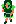
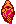

+++
title = "ラタニア北地方"
+++

* 東の島: イスパ島

他地域へのアクセス:

* (86, 15) の関所から[ユース地方](@/map/map-00/_index.md) (89, 243) へ。
* (58, 248) の関所から[ラタニア南地方](@/map/map-08/_index.md) (53, 20) へ (通行料 100)。
* (237, 26) の骨ワープから[ユース地方](@/map/map-00/_index.md) (148, 216) へ。
* [ザイドタウンの町](@/map/map-12/_index.md)の[初心の館出口](@/map/map-13b/_index.md#event-112-214)から[ユース地方](@/map/map-00/_index.md) (173, 206) へ。
* イスパ島 [ラモンの町](@/map/map-12/_index.md)の[初心の館出口](@/map/map-13b/_index.md#event-112-214)から[ユース地方](@/map/map-00/_index.md) (173, 206) へ。
* イスパ島 [ラモンの町の墓](@/map/map-12/_index.md#event-207-227)で風の粉を持って曼荼羅を使うと[ユース地方](@/map/map-00/_index.md) (0, 1) の海上へ (ハマリ)。
* (161, 74) の石ワープから[エウロン西地方](@/map/map-01/_index.md) (109, 119) へ (通常プレイでは到達不能と思われる)。

他地域からのアクセス:

* [ユース地方](@/map/map-00/_index.md) (90, 248) の関所から (85, 20) へ。
* [ラタニア南地方](@/map/map-08/_index.md) (54, 15) の関所から (57, 243) へ。
* 各地の[惑いの宿出口](@/map/map-13b/_index.md#event-240-150)からランダムで (19, 169) へ。
* 各地の[惑いの宿出口](@/map/map-13b/_index.md#event-240-150)からランダムでイスパ島 (188, 124) へ。

出現NPC:

*  アマゾネス
*  占い師

<!-- SVG {{{ -->
<svg width="1536" height="1536" viewbox="0 0 2048 2048">
<defs>
<image id="svg-asset-bg" width="2048" height="2048" href="map-04.webp" />
<image id="svg-asset-event" width="16" height="16" href="icon-event.png" />
<image id="svg-asset-destination" width="16" height="16" href="icon-destination.png" />
<image id="svg-asset-actor-0x1F-a" width="16" height="24" href="actor-0x1F-a.png" />
<image id="svg-asset-actor-0x22-a" width="16" height="24" href="actor-0x22-a.png" />
</defs>
<use href="#svg-asset-bg" x="0" y="0"></use>
<text class="caption-48" x="1736" y="1304" fill="pink">イスパ島</text>
<text class="caption-32" x="708" y="120" fill="yellow">関</text>
<text class="caption-24" x="148" y="1344" fill="yellow">惑</text>
<text class="caption-32" x="416" y="2032" fill="yellow">関</text>
<text class="caption-24" x="760" y="1952" fill="yellow">手形</text>
<text class="caption-24" x="1040" y="1940" fill="yellow">どくろばな</text>
<text class="caption-24" x="1348" y="1312" fill="yellow">船</text>
<text class="caption-32" x="1504" y="1472" fill="yellow">ザイドタウン</text>
<text class="caption-24" x="1532" y="1212" fill="yellow">船</text>
<text class="caption-32" x="1680" y="1088" fill="yellow">ラモン</text>
<text class="caption-24" x="1504" y="984" fill="yellow">惑</text>
<text class="caption-24" x="1756" y="824" fill="yellow">石</text>
<text class="caption-24" x="1892" y="760" fill="yellow">骨</text>
<text class="caption-24" x="1500" y="704" fill="yellow">石</text>
<text class="caption-24" x="1284" y="632" fill="yellow">石</text>
<text class="caption-24" x="1936" y="272" fill="yellow">骨</text>
<text class="caption-24" x="1868" y="236" fill="yellow">骨</text>
<rect x="1536" y="256" width="128" height="128" stroke="red" fill="none" />
<use href="#svg-asset-actor-0x1F-a" x="1592" y="308"><title>アマゾネス「いい天気ですね」</title></use>
<rect x="640" y="384" width="128" height="128" stroke="red" fill="none" />
<use href="#svg-asset-actor-0x1F-a" x="696" y="436"><title>アマゾネス「初心の家に入るとユースに戻されるよ」</title></use>
<rect x="896" y="384" width="128" height="128" stroke="red" fill="none" />
<use href="#svg-asset-actor-0x1F-a" x="952" y="436"><title>アマゾネス「1番目はアイテム屋 4番目は船小屋さ」</title></use>
<rect x="1152" y="640" width="128" height="128" stroke="red" fill="none" />
<use href="#svg-asset-actor-0x1F-a" x="1208" y="692"><title>アマゾネス「気をつけて行きな」(到達不能)</title></use>
<rect x="1536" y="640" width="128" height="128" stroke="red" fill="none" />
<use href="#svg-asset-actor-0x1F-a" x="1592" y="692"><title>アマゾネス「試合に勝って名声を上げなさい」(到達不能)</title></use>
<rect x="1664" y="896" width="128" height="128" stroke="red" fill="none" />
<use href="#svg-asset-actor-0x22-a" x="1720" y="948"><title>占い師「この世には二つ不思議な店がある 初心の家と惑いの宿じゃ」</title></use>
<rect x="640" y="1024" width="128" height="128" stroke="red" fill="none" />
<use href="#svg-asset-actor-0x22-a" x="696" y="1076"><title>占い師「この世には二つ不思議な店がある 初心の家と惑いの宿じゃ」</title></use>
<rect x="1024" y="1152" width="128" height="128" stroke="red" fill="none" />
<use href="#svg-asset-actor-0x22-a" x="1080" y="1204"><title>占い師「ザイドタウンには2つの初心の家がある」</title></use>
<rect x="512" y="1408" width="128" height="128" stroke="red" fill="none" />
<use href="#svg-asset-actor-0x22-a" x="568" y="1460"><title>占い師「旅の間に仲間は減るのだ」</title></use>
<rect x="1408" y="1792" width="128" height="128" stroke="red" fill="none" />
<use href="#svg-asset-actor-0x22-a" x="1464" y="1844"><title>占い師「ザイドでラモンの扉が開く」</title></use>
<a href="#event-58-248">
<use href="#svg-asset-event" x="464" y="1984"><title>(58, 248): イベント 0xAA: 関所 (ラタニア南地方 (53, 20) へ)</title></use>
</a>
<a href="#event-86-15">
<use href="#svg-asset-event" x="688" y="120"><title>(86, 15): イベント 0xA1: 関所 (ユース地方 (89, 243) へ)</title></use>
</a>
<a href="#event-93-245">
<use href="#svg-asset-event" x="744" y="1960"><title>(93, 245): イベント 0xEB: 手形の落とし物</title></use>
</a>
<a href="#event-137-237">
<use href="#svg-asset-event" x="1096" y="1896"><title>(137, 237): イベント 0xF4: どくろばなを入手</title></use>
</a>
<a href="#event-161-74">
<use href="#svg-asset-event" x="1288" y="592"><title>(161, 74): イベント 0x7C: 石ワープ (エウロン西地方 (109, 119) へ)</title></use>
</a>
<a href="#event-185-86">
<use href="#svg-asset-event" x="1480" y="688"><title>(185, 86): イベント 0x7D: 石ワープ ((220, 98) へ)</title></use>
</a>
<a href="#event-202-191">
<use href="#svg-asset-event" x="1616" y="1528"><title>(202, 191): イベント 0x07: ザイドタウンの町の入口へ</title></use>
</a>
<a href="#event-218-143">
<use href="#svg-asset-event" x="1744" y="1144"><title>(218, 143): イベント 0x09: ラモンの町の入口へ</title></use>
</a>
<a href="#event-237-26">
<use href="#svg-asset-event" x="1896" y="208"><title>(237, 26): イベント 0x8B: 骨ワープ (ユース地方 (148, 216) へ)</title></use>
</a>
<a href="#event-237-90">
<use href="#svg-asset-event" x="1896" y="720"><title>(237, 90): イベント 0x8D: 骨ワープ ((240, 29) へ)</title></use>
</a>
<a href="#dst-201-194">
<use href="#svg-asset-destination" x="1608" y="1552"><title>(201, 194): ワープ先 0x08: ザイドタウンの町手前</title></use>
</a>
<a href="#dst-217-146">
<use href="#svg-asset-destination" x="1736" y="1168"><title>(217, 146): ワープ先 0x0A: ラモンの町手前</title></use>
</a>
<a href="#dst-220-98">
<use href="#svg-asset-destination" x="1760" y="784"><title>(220, 98): ワープ先 0x7D: (185, 86) の石ワープ先</title></use>
</a>
<a href="#dst-240-29">
<use href="#svg-asset-destination" x="1920" y="232"><title>(240, 29): ワープ先 0x8D: (237, 90) の骨ワープ先</title></use>
</a>
<a href="#dst-85-20">
<use href="#svg-asset-destination" x="680" y="160"><title>(85, 20): ワープ先 0xA0: ユース地方への関所手前</title></use>
</a>
<a href="#dst-57-243">
<use href="#svg-asset-destination" x="456" y="1944"><title>(57, 243): ワープ先 0xAB: ラタニア南地方への関所手前</title></use>
</a>
<a href="#dst-19-169">
<use href="#svg-asset-destination" x="152" y="1352"><title>(19, 169): ワープ先 0xCF: 惑いの宿出口の行き先候補</title></use>
</a>
<a href="#dst-188-124">
<use href="#svg-asset-destination" x="1504" y="992"><title>(188, 124): ワープ先 0xD0: 惑いの宿出口の行き先候補</title></use>
</a>
<a href="#dst-192-146">
<use href="#svg-asset-destination" x="1536" y="1168"><title>(192, 146): ワープ先 0xE7: ザイドタウンの町の船小屋の行き先</title></use>
</a>
<a href="#dst-166-165">
<use href="#svg-asset-destination" x="1328" y="1320"><title>(166, 165): ワープ先 0xE8: ラモンの町の船小屋の行き先</title></use>
</a>
</svg>
<!-- }}} -->

## イベント

### (58, 248): イベント 0xAA: 関所 ([ラタニア南地方](@/map/map-08/_index.md) [(53, 20)](@/map/map-08/_index.md#dst-53-20) へ) {#event-58-248}

通行料として金 100 を没収される (足りない場合は金が 0 になる)。

### (86, 15): イベント 0xA1: 関所 ([ユース地方](@/map/map-00/_index.md) [(89, 243)](@/map/map-00/_index.md#dst-89-243) へ) {#event-86-15}

### (93, 245): イベント 0xEB: 手形の落とし物 {#event-93-245}

手形所持数が 0 の状態で探索すると手形を 1 枚入手。

### (137, 237): イベント 0xF4: どくろばなを入手 {#event-137-237}

### (161, 74): イベント 0x7C: 石ワープ ([エウロン西地方](@/map/map-01/_index.md) [(109, 119)](@/map/map-01/_index.md#dst-109-119) へ) {#event-161-74}

通常プレイでは到達不能と思われる。

### (185, 86): イベント 0x7D: 石ワープ ([(220, 98)](#dst-220-98) へ) {#event-185-86}

通常プレイでは到達不能と思われる。

### (202, 191): イベント 0x07: [ザイドタウンの町の入口](@/map/map-12/_index.md#dst-165-242)へ {#event-202-191}

### (218, 143): イベント 0x09: [ラモンの町の入口](@/map/map-12/_index.md#dst-217-242)へ {#event-218-143}

### (237, 26): イベント 0x8B: 骨ワープ ([ユース地方](@/map/map-00/_index.md) [(148, 216)](@/map/map-00/_index.md#dst-148-216) へ) {#event-237-26}

### (237, 90): イベント 0x8D: 骨ワープ ([(240, 29)](#dst-240-29) へ) {#event-237-90}

## ワープ先

### (19, 169): ワープ先 0xCF: [惑いの宿出口](@/map/map-13b/_index.md#event-240-150)の行き先候補 {#dst-19-169}

### (57, 243): ワープ先 0xAB: [ラタニア南地方](@/map/map-08/_index.md)への関所手前 {#dst-57-243}

ワープ元: [ラタニア南地方](@/map/map-08/_index.md) [(54, 15)](@/map/map-08/_index.md#event-54-15) の関所。

### (85, 20): ワープ先 0xA0: [ユース地方](@/map/map-00/_index.md)への関所手前 {#dst-85-20}

ワープ元: [ユース地方](@/map/map-00/_index.md) [(90, 248)](@/map/map-00/_index.md#event-90-248) の関所。

### (166, 165): ワープ先 0xE8: [ラモンの町の船小屋](@/map/map-12/_index.md#event-220-207)の行き先 {#dst-166-165}

### (188, 124): ワープ先 0xD0: [惑いの宿出口](@/map/map-13b/_index.md#event-240-150)の行き先候補 {#dst-188-124}

### (192, 146): ワープ先 0xE7: [ザイドタウンの町の船小屋](@/map/map-12/_index.md#event-180-179)の行き先 {#dst-192-146}

### (201, 194): ワープ先 0x08: [ザイドタウンの町](@/map/map-12/_index.md#dst-165-242)手前 {#dst-201-194}

ワープ元: [ザイドタウンの町 (166, 245)](@/map/map-12/_index.md#event-166-245)。

### (217, 146): ワープ先 0x0A: [ラモンの町](@/map/map-12/_index.md#dst-217-242)手前 {#dst-217-146}

ワープ元: [ラモンの町 (218, 245)](@/map/map-12/_index.md#event-218-245)。

### (220, 98): ワープ先 0x7D: [(185, 86)](#event-185-86) の石ワープ先 {#dst-220-98}

ワープ元は通常プレイでは到達不能と思われる。

### (240, 29): ワープ先 0x8D: [(237, 90)](#event-237-90) の骨ワープ先 {#dst-240-29}

